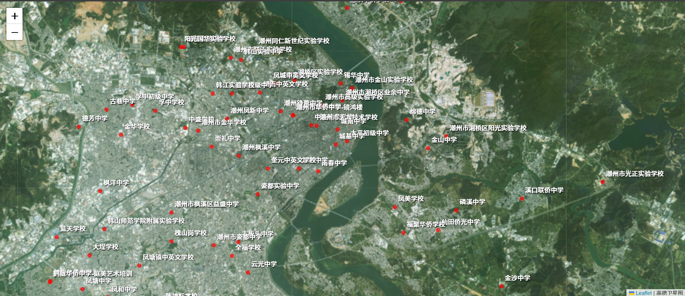
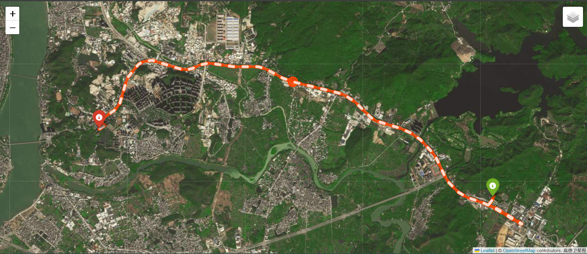
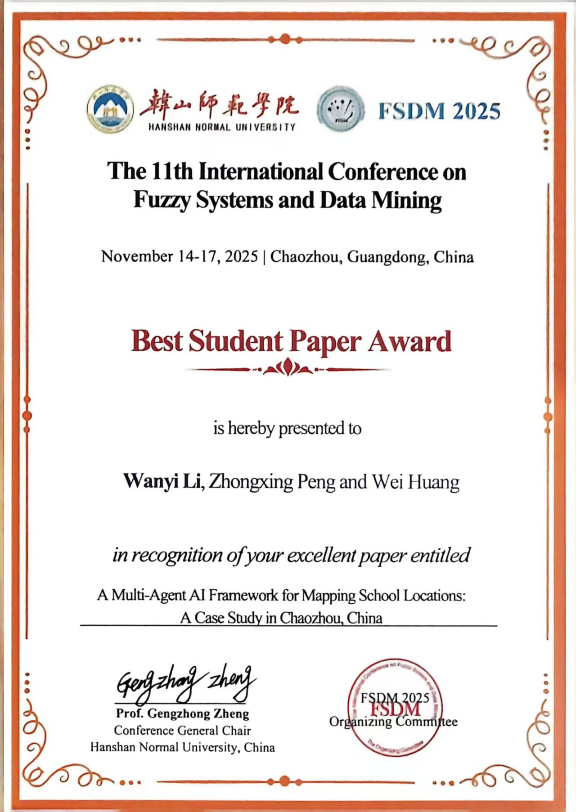
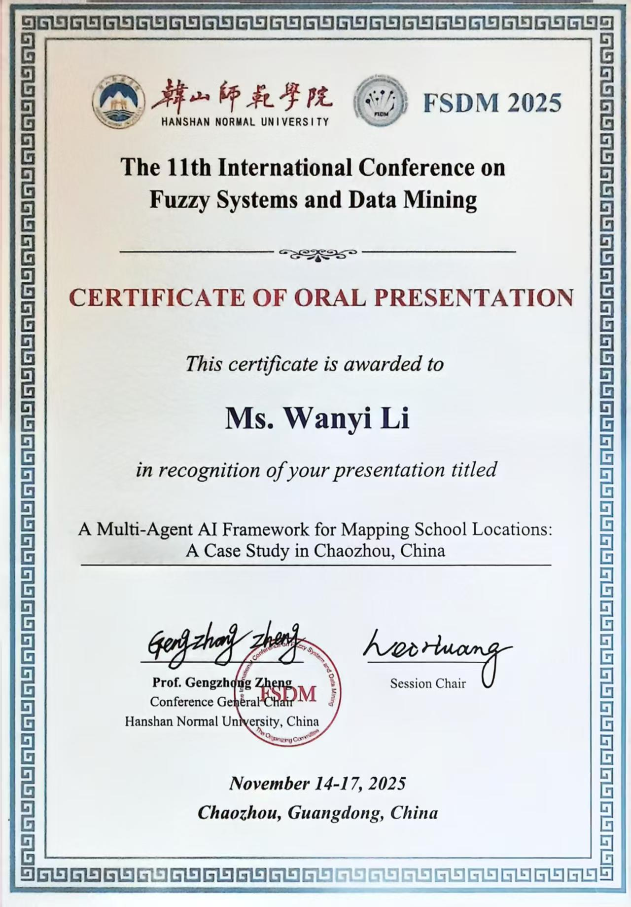

# 🏫 多智能体学校地理空间数据构建系统

> 多智能体AI框架 · 学校地理空间数据自动化采集与标准化 · FSDM 2025 最佳学生论文奖

[](https://www.python.org/)
[](https://www.coze.cn/)
[](https://lbs.amap.com/)
[](https://python-visualization.github.io/folium/)
[](./docs/FSDM2025_paper.pdf)
[](./docs/FSDM2025_certificate.jpg)
[](http://makeapullrequest.com)

---

## 📌 一句话说清这个项目

**用三个 AI 智能体协作，自动化采集、标准化、去重学校地理数据，构建高质量空间数据集，支撑教育资源配置决策。**

---

## 🎯 项目背景 · 为什么做

中国快速城市化 → 人口分布巨变 → 教育资源布局滞后 → 部分地区学校过剩/不足

**核心瓶颈**：缺乏标准化、精细化的学校地理空间数据
- 地图数据不完整、格式混乱
- 手工采集效率低、易出错
- 无法支撑数据驱动的教育政策制定

**本项目目标**：用 AI 自动化解决学校地理数据的采集与标准化问题

---

## 🧠 多智能体框架 · 怎么做的

三个 AI 智能体在 **Coze（扣子）** 平台上协作，形成完整的数据处理流水线：

```
┌─────────────────────────────────────────────────────────────────────┐
│                        多智能体协作流水线                           │
├─────────────────────────────────────────────────────────────────────┤
│                                                                     │
│  📥 原始数据        🤖 STR           🤖 SNSE          🤖 SNDE      │
│  ┌──────────┐    ┌────────────┐   ┌────────────┐  ┌────────────┐   │
│  │ 高德POI  │ -> │ 学校类型   │ -> │ 学校名称   │ ->│ 去重合并   │   │
│  │ 856条    │    │ 自动识别   │    │ 自动标准化 │   │ 智能查重   │   │
│  └──────────┘    └────────────┘   └────────────┘  └────────────┘   │
│                                                                     │
└─────────────────────────────────────────────────────────────────────┘
                                                                              ↓
                                                              ✅ 638条标准化数据
```

| 智能体 | 核心能力 | 技术方法 |
|--------|---------|----------|
| **STR** | 学校类型自动识别 | 关键词提取 + 地址线索 + 省级数据库模糊匹配 |
| **SNSE** | 学校名称标准化 | 正则匹配 + 格式统一 + 括号标准化 |
| **SNDE** | 智能去重合并 | 包含检查 + 词向量相似度匹配 |

---

## 🛠️ 技术栈 · 用了什么

| 类别 | 技术 | 说明 |
|------|------|------|
| **AI 智能体** | Coze（扣子） | 三个智能体的部署与编排平台 |
| **地理数据处理** | GeoPandas + Shapely | 空间数据处理与几何运算 |
| **地图 API** | 高德地图 + 天地图 | POI 数据获取与坐标校准 |
| **卫星影像标注** | LabelMe | 学校边界多边形人工标注 |
| **数据可视化** | Folium + Leaflet | 交互式 HTML 地图生成 |
| **数据分析** | K-means + t-SNE + Hu矩 | 学校形态特征聚类分析 |
| **开发语言** | Python 3.9+ | 核心脚本与自动化流程 |

---

## 📊 核心成果 · 产出了什么

| 指标 | 数据 |
|------|------|
| 覆盖学校 | **638 所** K-12 学校（潮州市） |
| 数据处理 | 856 条原始记录 → 638 条标准化数据（去重率 25.5%）|
| 卫星影像 | 每所学校标注**边界多边形** |
| 占地面积 | ✅ 全部估算完成 |
| 形态聚类 | 8 类形态特征（K-means）|
| 人口对比 | 覆盖 3 大行政区 |

### 📍 人口与学校分布对比（潮州三大行政区）

| 行政区 | 出生人口占比 | 小学占比 | 中学占比 | 结论 |
|--------|-------------|---------|---------|------|
| 潮安区 | 46.78% | 49.7% | 42.7% | ✅ 基本均衡 |
| 饶平县 | 36.48% | 31.8% | 30.0% | ⚠️ 学校相对不足 |
| 湘桥区 | 16.73% | 18.5% | 27.3% | 📍 城区中学集中 |

> 💡 **洞察**：饶平县学校数量低于人口占比，可能存在教育资源缺口；湘桥区作为城区，中学资源高度集中。

---
## 📷 预览截图

| 学校分布图 | 路线规划图 |
|:---:|:---:|
|  |  |
---

## 📄 论文与获奖 · 学术认可

- 论文发表于 **FSDM 2025**（第11届模糊系统与数据挖掘国际会议）
- 🏆 荣获 **最佳学生论文奖（Best Student Paper Award）**

| 证书 | 说明 |
|------|------|
|  | 最佳学生论文奖证书 |
|  | 会议口头报告证书 |

---

## 🚀 快速上手 · 怎么跑起来

```bash
# 1. 克隆仓库
git clone https://github.com/Wanyi-Li-CN/school-mapping-multi-agent-ai.git
cd school-mapping-multi-agent-ai

# 2. 安装依赖
pip install -r requirements.txt

# 3. 配置高德地图 API Key（在 .env 文件中）
echo "AMAP_KEY=你的高德地图密钥" > .env

# 4. 运行地图生成脚本
python src/自定义城市_schools_map.py
```

---

## 📂 项目结构 · 怎么组织的

```
school-mapping-multi-agent-ai/
├── README.md                    # 项目说明文档
├── requirements.txt             # Python 依赖清单
├── .gitignore                   # Git 忽略文件
├── .env.example                 # 环境变量模板
│
├── src/                         # 📁 源代码
│   ├── 自定义城市_schools_map.py   # 核心：学校地图生成
│   ├── 百度卫星图API_路线提取.py    # 高德地图路线规划
│   └── 外网的卫星图API_路线提取.py  # OSM 路网路线规划
│
├── data/                        # 📁 样例数据
│   └── 潮州市_市.geojson           # 潮州市行政区划边界
│
├── outputs/                     # 📁 可视化成果
│   ├── 潮州_schools_map.html      # 交互式学校分布地图
│   ├── 潮州市学校路线图.html       # 交互式路线规划地图
│   ├── screenshot_map.png         # 学校分布图截图
│   └── screenshot_route.png       # 路线规划图截图
│
└── docs/                        # 📁 论文与证书
    ├── FSDM2025_paper.pdf          # 会议论文全文
    ├── FSDM2025_certificate.jpg    # 最佳学生论文奖证书
    └── FSDM2025_presentation_certificate.jpg  # 口头报告证书
```

---

## 👩‍💻 作者

**李万义（Wanyi Li）**  

📧 3066129214@qq.com  

🔗 会议论文：FSDM 2025

---

## 📝 许可证

MIT © 2025 Wanyi Li
